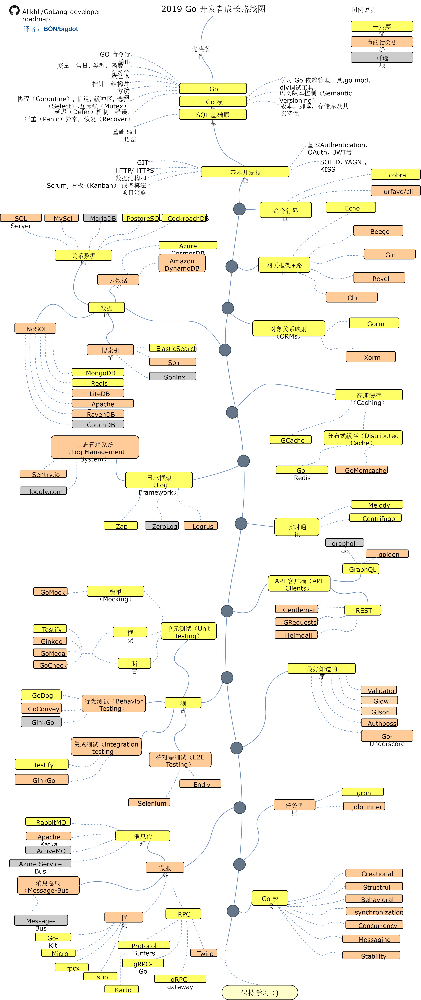

# Go语言模式设计
---
# Go 开发者路线图

> 在 2019 成为一名 [Go](https://golang.org/) 开发者的路线图：

--------

This RoadMap is Created by [Alikhll (Ali Khalili)](https://github.com/Alikhll)  and Translated by [BON](https://github.com/Quorafind), the original repositoriy is [Alikhll/golang-developer-roadmap](https://github.com/Alikhll/golang-developer-roadmap) .

该路线图由 [Alikhll (Ali Khalili)](https://github.com/Alikhll)  制作，由 [BON](https://github.com/Quorafind) 翻译为中文。原仓库链接为： [Alikhll/golang-developer-roadmap](https://github.com/Alikhll/golang-developer-roadmap) 。

该仓库遵守与原仓库相同的 **[CC BY-NC-SA 4.0](https://creativecommons.org/licenses/by-nc-sa/4.0/deed.zh)** 协议。

------

在下边有一个图表，如果你想要成为一名 Go 的开发者的话，里面记录了一条成长路线以及一些你也许可以用得上的库。这是我为每一个想要问我：“我该怎么才能成为 Go 的开发者？”的人而准备的。


## 路线图



## 资源

1. 先决条件

   - [Go](https://golangbot.com/)
   - [Go Modules](https://blog.golang.org/using-go-modules)
   - [SQL](https://www.w3schools.com/sql/default.asp)

2. 通用开发技能

   - 学习 GIT，在 GitHub 上建立一些仓库，与其它人分享你的代码
   - 了解 HTTP(S) 协议，request 方法（GET, POST, PUT, PATCH, DELETE, OPTIONS）
   - 不要害怕使用 Google，[Google 搜索的力量](http://www.powersearchingwithgoogle.com/)
   - 看一些和数据结构以及算法有关的书籍
   - 学习关于认证的基础实现
   - 面向对象原则等等

3. 命令行工具
   1. [cobra](https://github.com/spf13/cobra)
   2. [urfave/cli](https://github.com/urfave/cli)

4. 网页框架 + 路由

   1. [Echo](https://github.com/labstack/echo)
   2. [Beego](https://github.com/astaxie/beego)
   3. [Gin](https://github.com/gin-gonic/gin)
   4. [Revel](https://github.com/revel/revel)
   5. [Chi](https://github.com/go-chi/chi)

5. 数据库

   1. 关系型
      1. [SQL Server](https://www.microsoft.com/en-us/sql-server/sql-server-2017)
      2. [PostgreSQL](https://www.postgresql.org/)
      3. [MariaDB](https://mariadb.org/)
      4. [MySQL](https://www.mysql.com/)
      5. [CockroachDB](https://www.cockroachlabs.com/)
   2. 云数据库
      - [CosmosDB](https://docs.microsoft.com/en-us/azure/cosmos-db)
      - [DynamoDB](https://aws.amazon.com/dynamodb/)
   3. 搜索引擎
      - [ElasticSearch](https://www.elastic.co/)
      - [Solr](http://lucene.apache.org/solr/)
      - [Sphinx](http://sphinxsearch.com/)
   4. NoSQL
      - [MongoDB](https://www.mongodb.com/)
      - [Redis](https://redis.io/)
      - [Apache Cassandra](http://cassandra.apache.org/)
      - [LiteDB](https://github.com/mbdavid/LiteDB)
      - [RavenDB](https://github.com/ravendb/ravendb)
      - [CouchDB](http://couchdb.apache.org/)

6. 对象关系映射框架

   1. [Gorm](https://github.com/jinzhu/gorm)
   2. [Xorm](https://github.com/go-xorm/xorm)

7. 高速缓存

   1. [GCache](https://github.com/bluele/gcache)
   2. 分布式缓存
      1. [Go-Redis](https://github.com/go-redis/redis)
      2. [GoMemcached](https://github.com/bradfitz/gomemcache)

8. 日志

   1. 日志框架
      - [Zap](https://github.com/uber-go/zap)
      - [ZeroLog](https://github.com/rs/zerolog)
      - [Logrus](https://github.com/sirupsen/logrus)
   2. 日志管理系统
      - [Sentry.io](http://sentry.io)
      - [Loggly.com](https://loggly.com)

9. 实时通讯
   1. [Socket.IO](https://socket.io/)

10. API 客户端

    1. REST
       - [Gentleman](https://github.com/h2non/gentleman)
       - [GRequests](https://github.com/kennethreitz/grequests)
       - [heimdall](https://github.com/heimdal/heimdal)
    2. [GraphQL](https://graphql.org/)
       - [gqlgen](https://github.com/99designs/gqlgen)
       - [graphql-go](https://github.com/graph-gophers/graphql-go)

11. 最好知道

    - [Validator](https://github.com/chriso/validator.js/)
    - [Glow](https://github.com/pytorch/glow)
    - [GJson](https://github.com/tidwall/gjson)
    - [Authboss](https://github.com/volatiletech/authboss)
    - [Go-Underscore](https://github.com/ahl5esoft/golang-underscore)

12. 测试

    1. 单元，行为，集成测试
       1. [GoMock](https://github.com/golang/mock)
       2. [Testify](https://github.com/stretchr/testify)
       3. [GinkGo](https://github.com/onsi/ginkgo)
       4. [GoMega](https://github.com/onsi/gomega)
       5. [GoCheck](https://github.com/go-check/check)
       6. [GoDog](https://github.com/DATA-DOG/godog)
       7. [GoConvey](https://github.com/smartystreets/goconvey)
    2. 端对端测试
       - [Selenium](https://github.com/tebeka/selenium)
       - [Endly](https://github.com/viant/endly)

13. 任务调度

    - [Gron](https://github.com/roylee0704/gron)
    - [JobRunner](https://github.com/bamzi/jobrunner)

14. 微服务

    1. 消息代理
       - [RabbitMQ](https://www.rabbitmq.com/tutorials/tutorial-one-go.html)
       - [Apache Kafka](https://kafka.apache.org/)
       - [ActiveMQ](https://github.com/apache/activemq)
       - [Azure Service Bus](https://docs.microsoft.com/en-us/azure/service-bus-messaging/service-bus-messaging-overview)
    2. 消息总线
       - [Message-Bus](https://github.com/vardius/message-bus)
    3. 框架
         - [GoKit](https://github.com/go-kit/kit)
         - [Micro](https://github.com/micro/go-micro)
         - [rpcx](https://github.com/smallnest/rpcx)
         - [istio](https://github.com/istio/istio)
    4. RPC
         - [Protocol Buffers](https://github.com/protocolbuffers/protobuf)
         - [gRPC-Go](https://github.com/grpc/grpc-go)
         - [gRPC-Gateway](https://github.com/grpc-ecosystem/grpc-gateway)
         - [Twirp](https://github.com/twitchtv/twirp)

15. [Go-模式](https://github.com/tmrts/go-patterns)


想法来源于 : [ASP.NET Core Developer Roadmap](https://github.com/MoienTajik/AspNetCore-Developer-Roadmap)


## 参考

- [github.com/senghoo/gol…](https://github.com/senghoo/golang-design-pattern)
- [github.com/yksz/go-des…](https://github.com/yksz/go-design-patterns)
- [github.com/svett/golan…](https://github.com/svett/golang-design-patterns)


 - [四月份平民](https://plus.google.com/110445767383269817959) (review代码)
 - [Hong Ruiqi](https://github.com/hongruiqi) (review代码)
 - [BianJiang](https://github.com/border) (编写go开发工具Vim和Emacs的设置)
 - [Oling Cat](https://github.com/OlingCat)(review代码)
 - [Wenlei Wu](mailto:spadesacn@gmail.com)(提供一些图片展示)
 - [polaris](https://github.com/polaris1119)(review书)
 - [雨痕](https://github.com/qyuhen)(review第二章)


* [(HTML - PDF) on GitBook](https://legacy.gitbook.com/book/astaxie/build-web-application-with-golang)

  

## simplefactory

对golang来说就是Newxx函数，返回interface， kubernetes interface随处可见，可以说能用interface抽象的就是interface，随便举一个例子

```go
// k8s.io/kubernetes/vendor/k8s.io/client-go/tools/cache/store.go
func NewStore(keyFunc KeyFunc) Store {
    return &cache{
        cacheStorage: NewThreadSafeStore(Indexers{}, Indices{}),
        keyFunc:      keyFunc,
    }
}

type cache struct {
    // cacheStorage bears the burden of thread safety for the cache
    cacheStorage ThreadSafeStore
    // keyFunc is used to make the key for objects stored in and retrieved from items, and
    // should be deterministic.
    keyFunc KeyFunc
}

type Store interface {
    Add(obj interface{}) error
    Update(obj interface{}) error
    Delete(obj interface{}) error
    List() []interface{}
    ListKeys() []string
    Get(obj interface{}) (item interface{}, exists bool, err error)
    GetByKey(key string) (item interface{}, exists bool, err error)

    // Replace will delete the contents of the store, using instead the
    // given list. Store takes ownership of the list, you should not reference
    // it after calling this function.
    Replace([]interface{}, string) error
    Resync() error
}复制代码
```

## facade / adapter / decorator / delegate / bridge / mediator / composite

组合模式的不同形式，这些随处可见，也不用深究其中的区别。

## singleton

kubernetes/golang 用得很少，一般使用全局变量(如配置) (比如 net/http package 的 http.DefaultClient 和 http.DefaultServeMux).  或者作为context传递。
实现方式可以参考[marcio.io/2015/07/sin…](http://marcio.io/2015/07/singleton-pattern-in-go/)

比较常见的一种方式是double check

```go
func GetInstance() *singleton {
    if instance == nil {     // <-- Not yet perfect. since it's not fully atomic
        mu.Lock()
        defer mu.Unlock()

        if instance == nil {
            instance = &singleton{}
        }
    }
    return instance
}复制代码
```

但是在golang里面有更好的一种方式，用"Once"

```go
type singleton struct {
}

var instance *singleton
var once sync.Once

func GetInstance() *singleton {
    once.Do(func() {
        instance = &singleton{}
    })
    return instance
}复制代码
```

## factory/ abstract factory ／ builder

关于这几种creational patterns 的区别:

- Builder focuses on constructing a complex object step by step. Abstract Factory emphasizes a family of product objects (either simple or complex). Builder returns the product as a final step, but as far as the Abstract Factory is concerned, the product gets returned immediately.
- Builder often builds a Composite.
- Often, designs start out using Factory Method (less complicated, more customizable, subclasses proliferate) and evolve toward Abstract Factory, Prototype, or Builder (more flexible, more complex) as the designer discovers where more flexibility is needed.
- Sometimes creational patterns are complementary: Builder can use one of the other patterns to implement which components get built. Abstract Factory, Builder, and Prototype can use Singleton in their implementations.

factory

```go
// k8s.io/kubernetes/vendor/k8s.io/apimachinery/pkg/runtime/serializer/codec_factory.go
func NewCodecFactory(scheme *runtime.Scheme) CodecFactory {
    serializers := newSerializersForScheme(scheme, json.DefaultMetaFactory)
    return newCodecFactory(scheme, serializers)
}

func (f CodecFactory) LegacyCodec(version ...schema.GroupVersion) runtime.Codec {
    return versioning.NewDefaultingCodecForScheme(f.scheme, f.legacySerializer, f.universal, schema.GroupVersions(version), runtime.InternalGroupVersioner)
}复制代码
```

abstract factory 以SharedInformerFactory为例，这个factory 能够create app/core/batch ...等各种interface

```go
//k8s.io/kubernetes/pkg/client/informers/informers_generated/internalversion/factory.go
func NewSharedInformerFactory(client internalclientset.Interface, defaultResync time.Duration) SharedInformerFactory {
    return &sharedInformerFactory{
        client:           client,
        defaultResync:    defaultResync,
        informers:        make(map[reflect.Type]cache.SharedIndexInformer),
        startedInformers: make(map[reflect.Type]bool),
    }
}

// SharedInformerFactory provides shared informers for resources in all known
// API group versions.
type SharedInformerFactory interface {
    internalinterfaces.SharedInformerFactory
    ForResource(resource schema.GroupVersionResource) (GenericInformer, error)
    WaitForCacheSync(stopCh <-chan struct{}) map[reflect.Type]bool

    Admissionregistration() admissionregistration.Interface
    Apps() apps.Interface
    Autoscaling() autoscaling.Interface
    Batch() batch.Interface
    Certificates() certificates.Interface
    Core() core.Interface
    Extensions() extensions.Interface
    Networking() networking.Interface
    Policy() policy.Interface
    Rbac() rbac.Interface
    Scheduling() scheduling.Interface
    Settings() settings.Interface
    Storage() storage.Interface
}

// sharedInformerFactory 是具体的stuct
func (f *sharedInformerFactory) Apps() apps.Interface {
    return apps.New(f)
}复制代码
```

builder 

```go
// k8s.io/kubernetes/pkg/controller/client_builder.go

func NewForConfigOrDie(c *rest.Config) *Clientset {
    var cs Clientset
    cs.admissionregistrationV1alpha1 = admissionregistrationv1alpha1.NewForConfigOrDie(c)
    cs.appsV1beta1 = appsv1beta1.NewForConfigOrDie(c)
    cs.appsV1beta2 = appsv1beta2.NewForConfigOrDie(c)
    cs.appsV1 = appsv1.NewForConfigOrDie(c)
    cs.authenticationV1 = authenticationv1.NewForConfigOrDie(c)
    cs.authenticationV1beta1 = authenticationv1beta1.NewForConfigOrDie(c)
    cs.authorizationV1 = authorizationv1.NewForConfigOrDie(c)
    cs.authorizationV1beta1 = authorizationv1beta1.NewForConfigOrDie(c)
    cs.autoscalingV1 = autoscalingv1.NewForConfigOrDie(c)
    cs.autoscalingV2beta1 = autoscalingv2beta1.NewForConfigOrDie(c)
    cs.batchV1 = batchv1.NewForConfigOrDie(c)
    cs.batchV1beta1 = batchv1beta1.NewForConfigOrDie(c)
    cs.batchV2alpha1 = batchv2alpha1.NewForConfigOrDie(c)
    cs.certificatesV1beta1 = certificatesv1beta1.NewForConfigOrDie(c)
    cs.coreV1 = corev1.NewForConfigOrDie(c)
    cs.extensionsV1beta1 = extensionsv1beta1.NewForConfigOrDie(c)
    cs.networkingV1 = networkingv1.NewForConfigOrDie(c)
    cs.policyV1beta1 = policyv1beta1.NewForConfigOrDie(c)
    cs.rbacV1 = rbacv1.NewForConfigOrDie(c)
    cs.rbacV1beta1 = rbacv1beta1.NewForConfigOrDie(c)
    cs.rbacV1alpha1 = rbacv1alpha1.NewForConfigOrDie(c)
    cs.schedulingV1alpha1 = schedulingv1alpha1.NewForConfigOrDie(c)
    cs.settingsV1alpha1 = settingsv1alpha1.NewForConfigOrDie(c)
    cs.storageV1beta1 = storagev1beta1.NewForConfigOrDie(c)
    cs.storageV1 = storagev1.NewForConfigOrDie(c)

    cs.DiscoveryClient = discovery.NewDiscoveryClientForConfigOrDie(c)
    return &cs
}复制代码
```

## prototype

原型模式是创建型模式的一种，其特点在于通过“复制”一个已经存在的实例来返回新的实例,而不是新建实例。被复制的实例就是我们所称的“原型”，这个原型是可定制的。
The Prototype Pattern creates duplicate objects while keeping `performance` in mind. It's a part of the creational patterns and provides one of the best ways to create an object.

参考[blog.ralch.com/tutorial/de…](http://blog.ralch.com/tutorial/design-patterns/golang-prototype/)

kubernetes使用了deepcopy-gen自动生成对象的deepcopy等方法，比如下面的一个生成的例子

```go
// k8s.io/kubernetes/vendor/k8s.io/apiserver/pkg/apis/audit/zz_generated.deepcopy.go
// DeepCopyInto is an autogenerated deepcopy function, copying the receiver, writing into out. in must be non-nil.

func (in *GroupResources) DeepCopyInto(out *GroupResources) {
    *out = *in
    if in.Resources != nil {
        in, out := &in.Resources, &out.Resources
        *out = make([]string, len(*in))
        copy(*out, *in)
    }
    if in.ResourceNames != nil {
        in, out := &in.ResourceNames, &out.ResourceNames
        *out = make([]string, len(*in))
        copy(*out, *in)
    }
    return
}

// DeepCopy is an autogenerated deepcopy function, copying the receiver, creating a new GroupResources.
func (in *GroupResources) DeepCopy() *GroupResources {
    if in == nil {
        return nil
    }
    out := new(GroupResources)
    in.DeepCopyInto(out)
    return out
}复制代码
```

生成的工具在这里 k8s.io/kubernetes/vendor/k8s.io/code-generator/cmd/deepcopy-gen/main.go
使用 [github.com/kubernetes/…](https://github.com/kubernetes/gengo)

## observer

这个模式在kubernetes里面也比较常见，比如sharedInformer就是一个观察者模式的实现

```go
// k8s.io/client-go/tools/cache/shared_informer.go
func (s *sharedIndexInformer) AddEventHandlerWithResyncPeriod(handler ResourceEventHandler, resyncPeriod time.Duration) {
    ...
    s.processor.addListener(listener)
    ...
}


// 分发
func (p *sharedProcessor) distribute(obj interface{}, sync bool) {
    p.listenersLock.RLock()
    defer p.listenersLock.RUnlock()

    if sync {
        for _, listener := range p.syncingListeners {
            listener.add(obj)
        }
    } else {
        for _, listener := range p.listeners {
            listener.add(obj)
        }
    }
}复制代码
```

## command

定义: 命令模式(Command Pattern)：将一个请求封装为一个对象，从而使我们可用不同的请求对客户进行参数化；对请求排队或者记录请求日志，以及支持可撤销的操作。命令模式是一种对象行为型模式，其别名为动作(Action)模式或事务(Transaction)模式。
kubernetes 的command 基于 github.com/spf13/cobra, 把命令变成了对象，比如cmdRollOut还实现了undo。

## interator

和数据结构相关的package里面用得比较多.如引用的库jsoniter, btree, govalidator.

```
// golang标准库 "go/token" 实现了Iterate方法，但是其实这里更像vistor模式...
func (s *FileSet) Iterate(f func(*File) bool)复制代码
```

## strategy

定义一系列算法，让这些算法在运行时可以互换，使得分离算法，符合开闭原则。对象有某个行为，但是在不同的场景中，该行为有不同的实现算法。
实际上使用interface的都像是strategy模式，从这方面看strategy模式只是字面上的强调意义，实现上和interface 实现的factory模式只是强调的点不一样，一个是强调创建型，一个是强调行为型
例子

```go
// k8s每种对象都对应了一个strategy，决定了update,delete,get 的策略
// 比如 /k8s.io/kubernetes/pkg/registry/core/configmap/strategy.go

// strategy implements behavior for ConfigMap objects
type strategy struct {
    runtime.ObjectTyper
    names.NameGenerator
}

// Strategy is the default logic that applies when creating and updating ConfigMap
// objects via the REST API.
var Strategy = strategy{api.Scheme, names.SimpleNameGenerator}

// Strategy should implement rest.RESTCreateStrategy
var _ rest.RESTCreateStrategy = Strategy

// Strategy should implement rest.RESTUpdateStrategy
var _ rest.RESTUpdateStrategy = Strategy

func (strategy) NamespaceScoped() bool {
    return true
}

func (strategy) PrepareForCreate(ctx genericapirequest.Context, obj runtime.Object) {
    _ = obj.(*api.ConfigMap)
}

func (strategy) Validate(ctx genericapirequest.Context, obj runtime.Object) field.ErrorList {
    cfg := obj.(*api.ConfigMap)

    return validation.ValidateConfigMap(cfg)
}

// Canonicalize normalizes the object after validation.
func (strategy) Canonicalize(obj runtime.Object) {
}

func (strategy) AllowCreateOnUpdate() bool {
    return false
}

func (strategy) PrepareForUpdate(ctx genericapirequest.Context, newObj, oldObj runtime.Object) {
    _ = oldObj.(*api.ConfigMap)
    _ = newObj.(*api.ConfigMap)
}

func (strategy) AllowUnconditionalUpdate() bool {
    return true
}

func (strategy) ValidateUpdate(ctx genericapirequest.Context, newObj, oldObj runtime.Object) field.ErrorList {
    oldCfg, newCfg := oldObj.(*api.ConfigMap), newObj.(*api.ConfigMap)

    return validation.ValidateConfigMapUpdate(newCfg, oldCfg)
}


// k8s.io/kubernetes/pkg/registry/core/configmap/storage/storage.go
// NewREST returns a RESTStorage object that will work with ConfigMap objects.
func NewREST(optsGetter generic.RESTOptionsGetter) *REST {
    store := &genericregistry.Store{
        NewFunc:                  func() runtime.Object { return &api.ConfigMap{} },
        NewListFunc:              func() runtime.Object { return &api.ConfigMapList{} },
        DefaultQualifiedResource: api.Resource("configmaps"),

        CreateStrategy: configmap.Strategy,
        UpdateStrategy: configmap.Strategy,
        DeleteStrategy: configmap.Strategy,
    }
    options := &generic.StoreOptions{RESTOptions: optsGetter}
    if err := store.CompleteWithOptions(options); err != nil {
        panic(err) // TODO: Propagate error up
    }
    return &REST{store}
}复制代码
```

## state

状态模式(State Pattern) ：允许一个对象在其内部状态改变时改变它的行为，对象看起来似乎修改了它的类。其别名为状态对象(Objects for States)，状态模式是一种对象行为型模式。
分离状态和行为，比方说一个状态机的实现，就是一个标准的state 模式

```go
// k8s.io/kubernetes/vendor/github.com/coreos/etcd/raft/node.go
// Node represents a node in a raft cluster.
type Node interface {
    ....
    Step(ctx context.Context, msg pb.Message) error

    ....

    // Status returns the current status of the raft state machine.
    Status() Status
    ....
}复制代码
```

## memento

在不破坏封装性的前提下，捕获一个对象的内部状态，并在该对象之外保存这个状态。这样就可以将该对象恢复到原先保存的状态

```go
// k8s.io/kubernetes/pkg/registry/core/service/portallocator/allocator.go
// NewFromSnapshot allocates a PortAllocator and initializes it from a snapshot.
func NewFromSnapshot(snap *api.RangeAllocation) (*PortAllocator, error) {
    pr, err := net.ParsePortRange(snap.Range)
    if err != nil {
        return nil, err
    }
    r := NewPortAllocator(*pr)
    if err := r.Restore(*pr, snap.Data); err != nil {
        return nil, err
    }
    return r, nil
}

func (r *PortAllocator) Snapshot(dst *api.RangeAllocation) error {
    snapshottable, ok := r.alloc.(allocator.Snapshottable)
    if !ok {
        return fmt.Errorf("not a snapshottable allocator")
    }
    rangeString, data := snapshottable.Snapshot()
    dst.Range = rangeString
    dst.Data = data
    return nil
}复制代码
```

广义上看，deployment,statefulset等对象实现了rollback方法，也是类似memeto，比如deployment有各种version的replicaset的history备份，用于恢复历史版本。详细见k8s.io/kubernetes/pkg/controller/deployment/

## flyweight / object pool

flyweight强调的是对象复用，和object pool的目的是一样的。
One difference in that flyweights are commonly immutable instances, while resources acquired from the pool usually are mutable.
object pool在golang和kubernetes用得比较多，比如官方就有sync.pool

```
// k8s.io/kubernetes/staging/src/k8s.io/apiserver/pkg/storage/cacher.go

var timerPool sync.Pool

func (c *cacheWatcher) add(event *watchCacheEvent, budget *timeBudget) {
    ...

    t, ok := timerPool.Get().(*time.Timer)
    if ok {
        t.Reset(timeout)
    } else {
        t = time.NewTimer(timeout)
    }
    defer timerPool.Put(t)

    ....
}复制代码
```

## iterpreter

解释器模式定义一套语言文法，并设计该语言解释器，使用户能使用特定文法控制解释器行为。
这个在kubernetes的各种代码／文档生成工具中用得很多。

## chain_of_responsibility

也是一种组合模式.用的地方很多。职责链模式用于分离不同职责，并且动态组合相关职责。链对象包含当前职责对象以及下一个职责链。

```
// 这种wrapper 把函数处理交给childrens
// k8s.io/test-infra/velodrome/transform/plugins/multiplexer_wrapper.go
func NewMultiplexerPluginWrapper(plugins ...Plugin) *MultiplexerPluginWrapper {
    return &MultiplexerPluginWrapper{
        plugins: plugins,
    }
}

// 这种warpper 自己处理完了以后再交给clildrens
// k8s.io/test-infra/velodrome/transform/plugins/author_logger_wrapper.go
func NewAuthorLoggerPluginWrapper(plugin Plugin) *AuthorLoggerPluginWrapper {
    return &AuthorLoggerPluginWrapper{
        plugin: plugin,
    }
}

// 自己不处理，交给clildrens
...复制代码
```

## visit

对象只要预留访问者接口(如Accept)则后期为对象添加功能的时候就不需要改动对象。本质就是让外部可以定义一种visit自己对象的方法，从这个角度看，只要visit作为一个函数传递就是一个visit模式。即

```
func(a *A)Visit(Vistor func(*A) error){
    Vistor(a)
}复制代码
```

例子

```go
// k8s.io/kubernetes/pkg/kubectl/cmd/util/openapi/openapi.go
type SchemaVisitor interface {
    VisitArray(*Array)
    VisitMap(*Map)
    VisitPrimitive(*Primitive)
    VisitKind(*Kind)
    VisitReference(Reference)
}

// Schema is the base definition of an openapi type.
type Schema interface {
    // Giving a visitor here will let you visit the actual type.
    Accept(SchemaVisitor)

    // Pretty print the name of the type.
    GetName() string
    // Describes how to access this field.
    GetPath() *Path
    // Describes the field.
    GetDescription() string
    // Returns type extensions.
    GetExtensions() map[string]interface{}
}复制代码
// /k8s.io/kubernetes/pkg/kubectl/resource/builder.go
func (b *Builder) visitByName() *Result {
    ...

    visitors := []Visitor{}
    for _, name := range b.names {
        info := NewInfo(client, mapping, selectorNamespace, name, b.export)
        visitors = append(visitors, info)
    }
    result.visitor = VisitorList(visitors)
    result.sources = visitors
    return result
}复制代码
```

## 贡献

这个路线图是用 [Draw.io](https://www.draw.io/) 做的。项目文件为该仓库下的 `golang-developer-roadmap.xml` 文件。 您如果想要修改它，您可以进入 [Draw.io](https://www.draw.io/) 点击打开已有图表并且选择这个 `xml` 文件。它会为您打开这个路线图。改进它，并且上传，以及更新该 ReadMe 中的对应图片，然后提交 PR（以 400% 的缩放导出 PNG 以及使用 [Compressor.io](https://compressor.io/compress) 来压缩它）。
